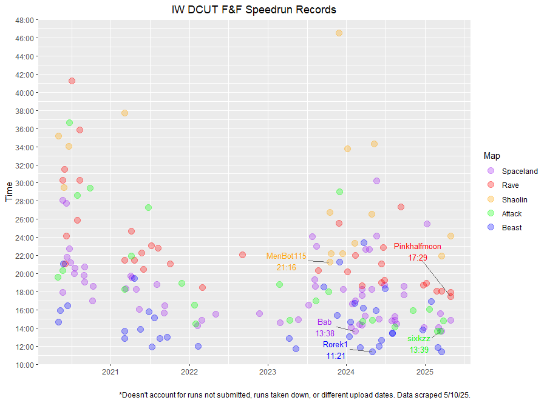

```{r setup, include=FALSE}
knitr::opts_chunk$set(echo = TRUE)
```

This is a simple data visualization of all speedrun records in the Zombies mode for the game *Call of Duty: Infinite Warfare*. Specifically, this is for the Easter Egg speedruns in the **'Solo Director’s Cut (Fate & Fortune Cards)'** category. World record holders (at the time) are highlighted.



## Breakdown
* Each colored circle represents one solo run submitted. 
* Runners can may have multiple cirlces if they submit to more than one map.
* Maps have different limitations for EE speed, resulting in somewhat of a "rainbow" effect.
* While this game is from 2016, no records are listed farther back than 2020. This is likely due to things like popularity and how Zombies World Record (ZWR) manages their boards (e.g. removing records from videos taken down, replacing a player's slower times with their fastest time, etc)
  + I'd like to track WR progression or popularity over time but this board design seems to prevent this.


## Process
* I created a web scraper in Python to collect the relevant data from the ZWR site, then I used R to depict them. 
* Creating the y-axis was the most challenging aspect due to how time is coded.
* Data were collected May 10th, 2025. 
  + As such, this graph is not an accurate depiction of the current leaderboard.

The current leaderboard can be found here: <https://zwr.gg/leaderboards/iw/ee-speedrun/>.


## Limitations
* Overlapping circles are difficult to parse.
* Even with the gridlines, this graph doesn't lend itself well to comparing data points across years.
* The few outliers on time stretch the scaling out, bunching up the data more.
* I'm not sure what to make of the shape of the data, particularly the middle gap. There could be many explanations (e.g. lull in the discoveries of new routes/techniques, release of other new games, etc).

Some of these limits could be improved by an interactive graph, which I may do.


I am still learning, so any advice, ideas, and constructive criticism is welcome!